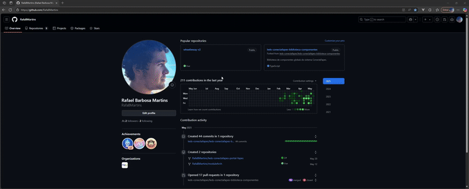

# Biblioteca de componentes LEDS-CONECTAFAPES

Biblioteca de componentes globais para os diferentes sistemas do Conecta Fapes.

## Sumário

- [Biblioteca de componentes LEDS-CONECTAFAPES](#biblioteca-de-componentes-leds-conectafapes)
  - [Sumário](#sumário)
  - [Sobre o projeto](#sobre-o-projeto)
  - [Pré-requisitos](#pré-requisitos)
  - [Instalação](#instalação)
  - [Estrutura de diretórios](#estrutura-de-diretórios)
  - [O que é Storybook?](#o-que-é-storybook)
  - [Criação](#criação)
  - [Desenvolvimento](#desenvolvimento)
    - [Quando o props for um v-model](#quando-o-props-for-um-v-model)
  - [Disponibilizando o componente para uso na biblioteca](#disponibilizando-o-componente-para-uso-na-biblioteca)
  - [Publicando uma nova versão](#publicando-uma-nova-versão)
  - [Git Hooks](#git-hooks)
    - [Scripts Úteis](#scripts-úteis)

## Sobre o projeto

A Biblioteca de Componentes LEDS-CONECTAFAPES foi criada com o objetivo de padronizar e centralizar os componentes visuais utilizados nos diferentes sistemas do ecossistema Conecta Fapes. Com ela, é possível garantir:

- Consistência visual entre as aplicações,

- Redução de retrabalho, evitando recriação de componentes comuns,

- Facilidade de manutenção, com atualizações centralizadas,

- Escalabilidade, permitindo o crescimento da base de código com organização.

- Esta biblioteca foi desenvolvida utilizando Vue 3, TypeScript e TailwindCSS, e está integrada ao Storybook para visualização e documentação interativa dos componentes.

## Pré-requisitos

Antes de começar, certifique-se de que você tem os seguintes requisitos instalados:

- [Node.js](https://nodejs.org/) na versão 23.9.0 ou similar
- npm na versão 11.3.0 ou similar

## Instalação

Siga estas etapas para configurar o projeto localmente:

1. Faça o fork do repositório principal para a sua conta no github

2. Clone o repositório

```shell
git clone https://github.com/leds-conectafapes/leds-conectafapes-biblioteca-componentes.git
cd leds-conectafapes-biblioteca-componentes
```

3. Instale os pacotes npm

```shell
npm install
```

Com o projeto configurado, você pode:

1. Rodar o servidor de desenvolvimento

```shell
npm run dev
```

2. Buildar o projeto para produção ou _preview_

```shell
npm run build
```

3. Após buildar, rodar o servidor de preview

```shell
npm run preview
```

4. Para rodar o storybook dos componentes

```shell
npm run storybook
```

## Estrutura de diretórios

```
leds-conectafapes-biblioteca-componentes/
├── src/
│   ├── style.css (Arquivo com style da biblioteca: cores, fontes)
│   ├── types.ts (Arquivo de exports da biblioteca)
│   ├── main.ts
│   ├── vitest (Arquivos de teste dos componentes)
│   │   └── meuComponente.test.ts
│   └── components/
│       └── meuComponente/
│           └── meuComponente.vue
│           └── meuComponente.stories.ts
│
├── .env
├── .gitignore
├── LICENSE
├── README.md
└── package.json
```

## O que é Storybook?

O Storybook é uma ferramenta que permite um workshop para a construção de UI de maneira isolada, ajudando ao desenvolvimento de cada componente sem a necessidade de rodar o app inteiro.

## Criação

Percebe-se que, na pasta `components/`, teremos uma pasta para cada componente. Por exemplo, o componente de botão, teremos a pasta:

```
src/
│
│
├── components/
│	  ├── Button/
│	  │	  ├── Button.vue
│	  │	  └── Button.stories.ts
```

Note que há o arquivo `Button.stories.ts`. Esse arquivo será utilizado pelo Storybook para gerar os casos visuais do `Button.vue` na sua própria interface.

## Desenvolvimento

Quando criado os arquivos, o primeiro passo é desenvolver o componente em si com o `<template>`.

`Button.vue`

```html
<template>
  <button
    type="button"
    class="
      w-full
      flex gap-2.5 items-center justify-center
      px-6 py-4 leading-tight
      rounded-lg
      text-base
      easy-in-out duration-300
      cursor-auto
      font-inter font-medium"
  ></button>
</template>
```

Como exemplo, temos esse botão feito utilizando o tailwind. Note que o botão não possui label nem uma função que é executada quando clicado.

Após desenvolver o estilo do botão, o próximo passo é a parte do `<script>`. Deve-se pensar em quais informações o botão deve receber da tela/componente pai, informações externas que não serão definidas no botão, os **`props`**.

No `<script>`:

```ts
import type { buttonVariant } from "../../types";

const props = withDefaults(
  defineProps<{
    label: string;
    variant?: buttonVariant;
  }>(),
  {
    variant: "primary",
  },
);
```

Note que a propriedade variant é do tipo `buttonVarian`, o qual está sendo importado a partir do arquivo `types.ts`. Nesse arquivo, o tipo é definido da seguinte forma:

```ts
export type buttonVariant =
  | "primary"
  | "danger"
  | "warning"
  | "secondary"
  | "secondaryDanger"
  | "disabled";
```

### Quando o props for um v-model

Quando queremos passar um ref ou um valor dinâmico do Parent para o componente, utilizamos o `defineModel()`, como no exemplo a seguir:

```ts
import type { PropType } from 'vue';

const model = defineModel({ type: [String, Number, Object, undefined] as PropType<string | number | { value: string | undefined } | undefined> })

<input v-model="model"/>
```

Definimos quais variáveis o botão irá receber do Parent, como no exemplo, a label e a variante. Note que, caso não seja informado a label ou a variante, essas variáveis receberão um valor pré definido, tornando-as opcionais.

Quando queremos criar variações de estilo, podemos fazer da seguinte forma:

```ts
const btnVariants = computed(() => {
  const variant: Record<buttonVariant, string> = {
    primary: "bg-primary-500 text-white hover:bg-primary-hover",
    danger: "bg-error-300 text-white hover:bg-error-hover",
    warning: "bg-warning-100 text-white hover:bg-warning-hover",
    secondary: "bg-white text-gray-700 hover:bg-gray-hover",
    secondaryDanger: "bg-white text-error-300 hover:bg-error-secondaryHover",
    disabled: "bg-gray-200 text-gray-500",
  };
  return variant[props.variant as keyof typeof variant] || variant.primary;
});
```

Criamos um tipo Classes para definir quais variantes vamos utilizar. Dentro do computed definimos quais são os estilos de cada variação e retornamos aquele baseado no props.

Dessa forma, o componente fica assim:

```html
<template>
  <button
    type="button"
    class="
      w-full
      flex gap-2.5 items-center justify-center
      px-6 py-4 leading-tight
      rounded-lg
      text-base
      easy-in-out duration-300
      cursor-auto
      font-inter font-medium"
    :class="btnVariants"
    :disabled="props.variant === 'disabled'"
  >
    {{ props.label }}
  </button>
</template>
```

Adicionamos o estilo da variante junto a estilização padrão do botão.

Para finalizar, o botão precisa de um evento de click para funcionar. Para isso, utilizamos **`emit`**.

Quando usamos emit, emitimos um evento qualquer. No caso do botão, estamos emitindo um evento de click. Dessa forma, quando chamamos o botão no Parent, podemos passar uma função para quando o usuário clicar.

No componente:

```ts
const emit = defineEmits<{
  (e: "onClick"): void;
}>();

const onClick = () => {
  emit("onClick");
};
```

```html
<template>
  <button
    type="button"
    class="
      flex gap-2.5 items-center justify-center
      px-6 py-4
      rounded-lg
      text-base
      ease-in-out 
      duration-300
      font-medium"
    :class="classes"
    @click="onClick"
  >
    {{ label }}
  </button>
</template>
```

No Parent:

```html
<GenericButton label="Label" variant="primary" @click="buscar" />
```

`buscar` é uma função do Parent.

Assim, o componente final ficaria assim:

```ts
<script lang="ts" setup>
import { computed } from 'vue';
import type { buttonVariant } from '../../types';

const props = withDefaults(defineProps<{
  label: string,
  variant?: buttonVariant,
}>(), {
  variant: 'primary'
});

const emit = defineEmits<{
  (e: 'onClick'): void;
}>();

const onClick = () => {
  emit("onClick")
};

const btnVariants = computed(() => {
  const variant: Record<buttonVariant, string> = {
    primary: 'bg-primary-500 text-white hover:bg-primary-hover',
    danger: 'bg-error-300 text-white hover:bg-error-hover',
    warning: 'bg-warning-100 text-white hover:bg-warning-hover',
    secondary: 'bg-white text-gray-700 hover:bg-gray-hover',
    secondaryDanger: 'bg-white text-error-300 hover:bg-error-secondaryHover',
    disabled: 'bg-gray-200 text-gray-500',
  }
  return variant[props.variant as keyof typeof variant] || variant.primary;
})
</script>

<template>
  <button
    type="button"
    class="
      w-full
      flex gap-2.5 items-center justify-center
      px-6 py-4 leading-tight
      rounded-lg
      text-base
      easy-in-out duration-300
      cursor-auto
      font-inter font-medium"
    :class="btnVariants"
    :disabled="props.variant === 'disabled'"
    @click="onClick"
  >
    {{ props.label }}
  </button>
</template>
```

## Disponibilizando o componente para uso na biblioteca

Para tornar o componente disponível para uso externo, abra o arquivo `types.ts` e adicione a seguinte linha de exportação:

```ts
export { default as GenericButton } from "./components/GenericButton/GenericButton.vue";
```

Isso permite que o componente `GenericButton` seja importado diretamente a partir da biblioteca.

## Publicando uma nova versão

Para publicar uma nova versão apenas acesse o github actions do repositorio principal e execute o workflow 'Bump Version and Publish'



Note que, antes de ser executado, o workflow solicita um parâmetro de versão. Você pode escolher entre três tipos de incremento:

- **Patch**: incrementa o último número da versão (ex: `1.1.x`);
- **Minor**: incrementa o segundo número (ex: `1.x.1`);
- **Major**: incrementa o primeiro número (ex: `x.1.1`).

Essa escolha segue a convenção [SemVer (Versionamento Semântico)](https://semver.org/).

## Git Hooks

Esse projeto conta com a ferramenta [Lefthook](https://github.com/evilmartians/lefthook) para auxílio do gerenciamento do repositório.

> ⚠️ **Faça uso do comando `npx lefthook install` sempre que o arquivo `lefthook.yml` for atualizado!**

### Scripts Úteis

Para rodar manualmente os hooks, utilize:

```
npx lefthook run pre-commit
npx lefthook run pre-push
npx lefthook run <nome_do_hook>
```
